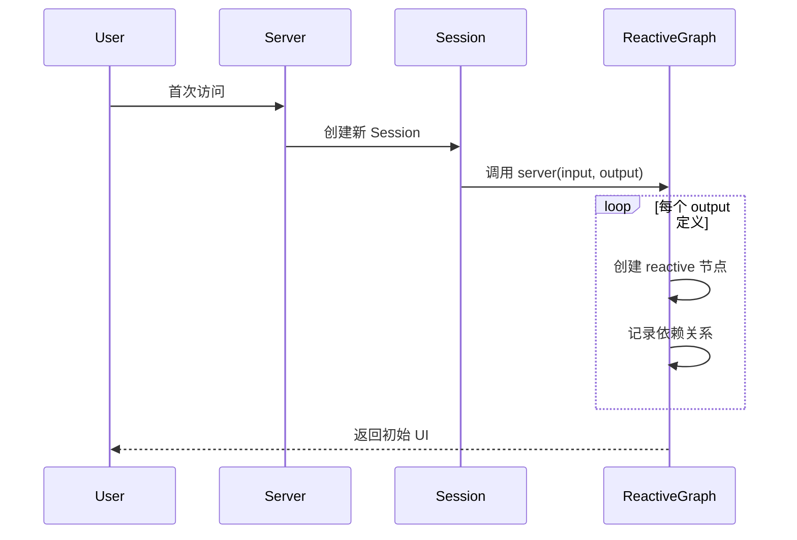

# Shiny 响应式引擎核心架构文档（增强版）

## 一、架构总览

### 1.1 核心设计哲学

```
Shiny 响应式引擎 = 惰性求值 + 自动依赖追踪 + 级联失效传播
```

**一句话本质**：一个基于**全局上下文栈**的**声明式 DAG 执行引擎**，让普通 R 代码自动获得响应式能力。

**顶层视角**：
```
Shiny = 网页版响应式 REPL
     = 自装配数据流框架
     = 符号即连接，代码即管线
```

### 1.2 架构分层

```
┌─────────────────────────────────────────────────────────┐
│                    应用层 (Application)                 │
│  ┌─────────┐  ┌─────────┐  ┌─────────┐  ┌─────────┐     │
│  │ UI 组件 │  │业务逻辑 │  │数据转换 │  │可视化   │     │
│  └─────────┘  └─────────┘  └─────────┘  └─────────┘     │
├─────────────────────────────────────────────────────────┤
│                  响应式层 (Reactive Layer)              │
│  ┌──────────────────────────────────────────────────┐   │
│  │  响应式节点：reactiveVal │ reactive │ observe    │   │
│  └──────────────────────────────────────────────────┘   │
│  ┌──────────────────────────────────────────────────┐   │
│  │  核心机制：依赖图 │ 失效传播 │ 惰性求值          │   │
│  └──────────────────────────────────────────────────┘   │
│  ┌──────────────────────────────────────────────────┐   │
│  │  基础设施：全局上下文栈 │ 闭包状态管理           │   │
│  └──────────────────────────────────────────────────┘   │
├─────────────────────────────────────────────────────────┤
│                   通信层 (Transport)                    │
│  ┌──────────────────────────────────────────────────┐   │
│  │  WebSocket │ HTTP │ Session 隔离 │ 状态同步      │   │
│  └──────────────────────────────────────────────────┘   │
├─────────────────────────────────────────────────────────┤
│                   运行时层 (Runtime)                    │
│  ┌──────────────────────────────────────────────────┐   │
│  │  R 进程池 │ 内存管理 │ 错误恢复 │ 调度器         │   │
│  └──────────────────────────────────────────────────┘   │
└─────────────────────────────────────────────────────────┘
```

---

## 二、核心数据结构

### 2.1 响应式节点基类

```
┌─────────────────────────────────────────┐
│          ReactiveNode (抽象)            │
├─────────────────────────────────────────┤
│ 状态:                                   │
│  - value: any           # 缓存值        │
│  - invalid: boolean     # 是否脏        │
│  - deps: List[Node]     # 上游依赖      │
│  - reverse_deps: List[Node] # 下游依赖  │
├─────────────────────────────────────────┤
│行为:                                    │
│  + invalidate(): void   # 标记失效      │
│  + get(): any           # 获取值        │
│  + addReverseDep(node)  # 添加反向依赖  │
└─────────────────────────────────────────┘
         △
         │
    ┌────┴───────────┬──────────┐
    │                │          │
┌───┴───────┐   ┌────┴───┐ ┌────┴────┐
│ReactiveVal│   │Reactive│ │ Observe │
│           │   │ Output │ │         │     
└───────────┘   └────────┘ └─────────┘
```

### 2.2 节点类型详解

#### ReactiveVal（源头节点）
```r
reactiveVal <- function(init = NULL) {
  env <- new.env()
  env$v <- init
  env$reverse_deps <- list()  # 谁依赖我
  
  fn <- function(value) {
    if (missing(value)) {
      # Getter: 注册当前上下文
      if (!is.null(.ctx)) {
        .ctx$deps <- c(.ctx$reverse_deps, env)
        env$reverse_deps <- c(env$reverse_deps, .ctx)
      }
      env$v
    } else {
      # Setter: 触发失效传播
      env$v <- value
      for (rdep in env$reverse_deps) {
        rdep$invalidate()
      }
    }
  }
  fn
}
```

**特性**：
- 存储**原始状态**
- **无上游依赖**（deps 为空）
- Setter 触发**广播失效**

#### Reactive（计算节点）
```r
reactive <- function(expr) {
  env <- new.env()
  env$invalid <- TRUE
  env$value <- NULL
  env$deps <- list()        # 我依赖谁
  env$reverse_deps <- list() # 谁依赖我
  env$expr <- expr
  
  fn <- function() {
    # 注册：当前上下文依赖我
    if (!is.null(.ctx)) {
      .ctx$deps <- c(.ctx$deps, env)
      env$reverse_deps <- c(env$reverse_deps, .ctx)
    }
    
    # 惰性求值
    if (env$invalid) {
      old <- .ctx
      .ctx <<- env
      
      # 清理旧依赖
      for (dep in env$deps) {
        dep$reverse_deps <- remove(env, dep$reverse_deps)
      }
      env$deps <- list()
      
      # 执行表达式（自动收集新依赖）
      env$value <- eval(env$expr)
      env$invalid <- FALSE
      
      .ctx <<- old
    }
    env$value
  }
  fn
}
```

**特性**：
- **惰性计算**：只在被读取时求值
- **自动依赖追踪**：执行时收集
- **结果缓存**：clean 时直接返回

#### Observe（终点节点）
```r
observe <- function(expr) {
  env <- new.env()
  env$invalid <- TRUE
  env$deps <- list()
  
  # 与 reactive 类似，但：
  # 1. 自动执行（不需要被读取）
  # 2. 执行副作用
  # 3. 不返回值
  
  execute <- function() {
    if (env$invalid) {
      # 类似 reactive 的依赖收集
      # 但执行 expr 不返回值
      env$invalid <- FALSE
    }
  }
  
  # 注册到调度器，失效时自动执行
  return(invisible())
}
```

**特性**：
- **主动执行**：失效后立即重算
- **副作用操作**：打印、绘图、写文件
- **无返回值**

---

## 三、核心机制

### 3.1 全局上下文栈（灵魂机制）

```
┌─────────────────────────────────────────┐
│          Global Context Stack           │
├─────────────────────────────────────────┤
│  ┌─────────────────────────────────┐    │
│  │   .ctx = Reactive Node C        │ ← 当前执行节点
│  └─────────────────────────────────┘    │
│  ┌─────────────────────────────────┐    │
│  │   .ctx = Reactive Node B        │    │
│  └─────────────────────────────────┘    │
│  ┌─────────────────────────────────┐    │
│  │   .ctx = Reactive Node A        │    │
│  └─────────────────────────────────┘    │
└─────────────────────────────────────────┘

工作流程：
1. 进入 reactive A：push .ctx = A
2. A 读取 reactiveVal X：X 注册 A 为依赖
3. A 调用 reactive B：push .ctx = B
4. B 读取 reactiveVal Y：Y 注册 B 为依赖
5. B 返回：pop .ctx = A
6. A 返回：pop .ctx = NULL
```

**核心价值**：
- **对普通函数透明**：任意嵌套都能自动追踪
- **无需修改 R 语法**：不依赖 AST 解析
- **零侵入设计**：只在 getter/setter 处检查

### 3.2 AST 深度遍历与符号栈机制（关键补充）

Shiny 的依赖追踪**不解析语法树、不重载运算符、不重写 `<-` 赋值符号**。它利用了 R 语言对表达式求值时的**深度优先遍历**机制。

**核心洞察**：
> 当执行 `z <- x() * f(y()) + 1` 时，R 解释器会对这棵语法树进行深度遍历求值。Shiny 的响应式引擎**只拦截对 `reactiveVal` 和 `reactive` 函数的调用**（即带有 `()` 的符号），而忽略所有其他普通符号和函数。

**符号栈模型**：
```
表达式: z <- x() * f(y()) + 1

AST 深度遍历顺序:
1. 进入乘法左分支: x()
   -> 检测到 reactive 符号 'x'，压入 .ctx 栈
   -> 执行 x()，建立依赖关系
   -> 弹出 .ctx

2. 进入乘法右分支: f(y())
   -> 进入普通函数 f，**.ctx 栈保持不变（透明穿透）**
   -> 在 f 内部求值参数: y()
   -> 检测到 reactive 符号 'y'，压入 .ctx 栈
   -> 执行 y()，建立依赖关系
   -> 弹出 .ctx

3. 执行普通函数 f 的返回值计算

4. 执行乘法运算

5. 执行加法运算

最终结果: z 的依赖列表包含 [x, y]
```

**为什么普通函数完全透明？**
因为 `.ctx` 是一个**包级全局变量**，它存在于 R 的环境链顶端。无论调用栈嵌套多少层普通函数，只要最终调用了 `x()`，读取 `.ctx` 时都能找到当前正在执行的响应式节点。普通函数无法修改或屏蔽 `.ctx`，因此**不中断依赖追踪**。

### 3.3 依赖图构建与维护

```
构建时机（依赖收集）：
┌──────────┐
│ Reactive │ 执行时
│    A     │──────┐
└──────────┘      │
                  ▼
         读取 ReactiveVal X
                  │
                  ▼
         X 注册 A 到 reverse_deps
                  │
                  ▼
         A 注册 X 到 deps

维护策略（失效传播）：
     ReactiveVal X 更新
            │
            ▼
    遍历 X$reverse_deps
            │
            ├─→ Reactive A: invalid = TRUE
            │         │
            │         ▼
            │    遍历 A$reverse_deps
            │         │
            │         └─→ Reactive C: invalid = TRUE
            │
            └─→ Reactive B: invalid = TRUE
```

### 3.4 依赖图可视化

```
输入层                  计算层                  输出层
┌─────────┐
│input$x  │ (reactiveVal)
└────┬────┘
     │ reverse_deps: [y]
     │
     ▼
┌─────────┐      ┌─────────┐
│   y     │ ───→ │  _3y    │
│reactive │      │reactive │
└────┬────┘      └────┬────┘
     │                │
     │ deps: [input$x]│ deps: [y]
     │                │
     └────────┬───────┘
              │
              ▼
        ┌──────────┐
        │ output$y │ (observe)
        └──────────┘

传播路径：
input$x 更新 → y 失效 → _3y 失效 → output$y 自动重算
```

---

## 四、完整数据流

### 4.1 初始化阶段



### 4.2 交互更新阶段

```
用户点击按钮
    │
    ▼
WebSocket: /session/input/xxx/set
    │
    ▼
后端: input$xxx(new_value)
    │
    ▼
reactiveVal setter:
    - 更新内部值
    - 遍历 reverse_deps
    - 标记所有下游为 invalid
    │
    ▼
级联失效传播:
    reactive A (invalid)
    reactive B (invalid)
    observe C (invalid)
    │
    ▼
调度器:
    - 收集所有失效的 observe/output
    - 按优先级排序
    - 异步执行
    │
    ▼
observe/output 执行:
    - 读取依赖（触发惰性求值）
    - reactive 链式重算
    - 生成新结果
    │
    ▼
WebSocket: 推送更新到前端
    │
    ▼
前端 DOM 自动更新
```

### 4.3 惰性求值细节

```
第一次读取 reactive R：
┌─────────────────────────────────────┐
│ R$invalid = TRUE                    │
├─────────────────────────────────────┤
│ 1. push .ctx = R                    │
│ 2. 清理旧的 deps 关系               │
│ 3. 执行表达式 expr                  │
│    ├─ 读取 A() → 注册依赖           │
│    ├─ 读取 B() → 注册依赖           │
│    └─ 计算 C = A + B                │
│ 4. 缓存结果到 R$value               │
│ 5. R$invalid = FALSE                │
│ 6. pop .ctx                         │
└─────────────────────────────────────┘
返回缓存值

第二次读取（未失效）：
┌─────────────────────────────────────┐
│ R$invalid = FALSE                   │
├─────────────────────────────────────┤
│ 直接返回 R$value（无计算）          │
└─────────────────────────────────────┘

上游更新后读取：
┌─────────────────────────────────────┐
│ R$invalid = TRUE (被上游标记)       │
├─────────────────────────────────────┤
│ 重新执行完整计算流程                │
└─────────────────────────────────────┘
```

---

## 五、Session 隔离机制

### 5.1 架构图

```
┌─────────────────────────────────────────────────────────┐
│                    Server Process                       │
├─────────────────────────────────────────────────────────┤
│                                                         │
│  ┌──────────────┐  ┌──────────────┐  ┌──────────────┐   │
│  │  Session 1   │  │  Session 2   │  │  Session N   │   │
│  │              │  │              │  │              │   │
│  │ ┌──────────┐ │  │ ┌──────────┐ │  │ ┌──────────┐ │   │
│  │ │ input$x  │ │  │ │ input$x  │ │  │ │ input$x  │ │   │
│  │ │   = 10   │ │  │ │   = 20   │ │  │ │   = 15   │ │   │
│  │ └──────────┘ │  │ └──────────┘ │  │ └──────────┘ │   │
│  │ ┌──────────┐ │  │ ┌──────────┐ │  │ ┌──────────┐ │   │
│  │ │   y =    │ │  │ │   y =    │ │  │ │   y =    │ │   │
│  │ │  x+1=11  │ │  │ │  x+1=21  │ │  │ │  x+1=16  │ │   │
│  │ └──────────┘ │  │ └──────────┘ │  │ └──────────┘ │   │
│  │              │  │              │  │              │   │
│  │ 独立依赖图   │  │ 独立依赖图   │  │ 独立依赖图   │   │
│  └──────────────┘  └──────────────┘  └──────────────┘   │
│                                                         │
│  共享资源：静态文件、全局函数、包                       │
└─────────────────────────────────────────────────────────┘
```

### 5.2 Server 函数即工厂

```r
server <- function(input, output, session) {
  # 每次新用户访问，这个函数执行一次
  # 创建全新的闭包环境
  
  # 每个用户独立的 reactiveVal
  user_data <- reactiveVal()
  
  # 每个用户独立的依赖图
  output$plot <- renderPlot({
    input$x  # 这个 input 属于当前 session
  })
  
  # 函数结束时，所有 reactive 节点被垃圾回收
}
```

**关键特性**：
- **状态隔离**：每个用户的 reactiveVal 互不干扰
- **计算隔离**：一个用户的密集计算不影响其他用户
- **自动清理**：session 结束，整个依赖图被回收

### 5.3 Session 隔离的 R 环境链实现（关键补充）

在 R 语言层面实现 Session 隔离，关键在于**正确绑定 `.ctx` 变量的查找环境**。

**问题**：如果在 `reactiveVal` 和 `reactive` 的闭包工厂函数内部直接定义 `.ctx`，那么每个 Session 会共享同一个全局 `.ctx`，导致不同用户之间的依赖关系混乱。

**解决方案**：将闭包环境的父环境强制设置为 `server` 函数的运行环境。

```r
reactive <- function(expr) {
  env <- new.env()
  # ... 其他状态初始化 ...
  
  # 【关键步骤】强制绑定环境链
  # 获取当前函数环境（即 reactive 闭包的实例化环境）
  thisenv <- environment()
  # 将父环境设置为调用 server 函数的环境（向上回溯两级调用栈）
  parent.env(thisenv) <- parent.frame(2)
  
  fn <- function() {
    # 这里的 .ctx 会沿着环境链查找：
    # fn -> reactive 闭包环境 -> server 环境 -> 全局环境
    # 由于 parent.env 被重定向，.ctx 会找到当前 Session 的 .ctx
    if (!is.null(.ctx)) { ... }
  }
  fn
}
```

**环境链图示**：
```
Session 1 环境链:
  reactive fn -> reactive 闭包(父环境=Server1) -> Server1(.ctx=Session1)

Session 2 环境链:
  reactive fn -> reactive 闭包(父环境=Server2) -> Server2(.ctx=Session2)

结果: 两个 Session 的 .ctx 查找路径完全隔离。
```

### 5.4 `output_def` 中的 `substitute` 陷阱（关键补充）

在封装 Shiny 风格的 API 时，常见的错误是错误处理 R 的**非标准求值（NSE）**。

**错误示例**：
```r
output_def <- function(session, name, expr) {
  captured_expr <- substitute(expr)  # 捕获 expr 的符号
  session$output[[name]] <- reactive(captured_expr)  # 传递符号
}
# 问题: reactive 内部再次 substitute，只能得到 'captured_expr' 这个符号本身！
```

**正确做法（使用 `do.call` 传递表达式源代码）**：
```r
output_def <- function(session, name, expr) {
  # 必须在调用 reactive 之前完成 substitute，并将结果作为表达式对象传递
  session$output[[name]] <- do.call(
    reactive, 
    args = list(expr = substitute(expr))
  )
}
# 原理: substitute(expr) 在这里执行，获得原始表达式的 AST。
# do.call 构造调用: reactive(expr = <原始AST>)
# reactive 内部的 substitute(expr) 拿到的是 <原始AST>，而非中间变量名。
```

这个细节是构建 Shiny 风格 DSL 的关键——**在正确的层级捕获表达式**。

---

## 六、与传统架构对比

### 6.1 传统 MVC（如 Spring/Flask）

```
┌─────────────────────────────────────────────┐
│                 MVC 架构                    │
├─────────────────────────────────────────────┤
│                                             │
│  用户请求 → Controller → Model → View       │
│      ↑                         ↓            │
│      └─────────────────────────┘            │
│                                             │
│  特点：                                     │
│  • 请求-响应模式                            │
│  • 手动连接 Model 和 View                   │
│  • 状态需显式管理（Session/DB）             │
│  • 更新需手动触发                           │
└─────────────────────────────────────────────┘
```

### 6.2 Shiny 响应式架构

```
┌─────────────────────────────────────────────┐
│            Shiny 响应式架构                 │
├─────────────────────────────────────────────┤
│                                             │
│  input$x (reactiveVal)                      │
│      ↓ 自动                                 │
│  reactive(y = x + 1)                        │
│      ↓ 自动                                 │
│  output$text (observe)                      │
│      ↓ 自动                                 │
│  前端更新                                   │
│                                             │
│  特点：                                     │
│  • 长连接（WebSocket）                      │
│  • 自动连接（符号即连接）                   │
│  • 状态内建（reactiveVal）                  │
│  • 自动更新（响应式传播）                   │
└─────────────────────────────────────────────┘
```

### 6.3 核心差异总结

| 维度 | 传统 MVC | Shiny 响应式 |
|------|----------|--------------|
| **连接方式** | 手动接线（Controller） | 自动装配（符号即连接） |
| **更新机制** | 请求-响应 | 推送-响应式传播 |
| **状态管理** | 显式（DB/Session） | 隐式（reactiveVal） |
| **依赖追踪** | 无 | 自动（上下文栈） |
| **并发模型** | 每请求新建 | 每会话隔离图 |
| **学习曲线** | 需理解 MVC 模式 | 需理解响应式思维 |

---

## 七、设计模式与最佳实践

### 7.1 核心设计模式

#### 1. **观察者模式（增强版）**
```r
# Subject: reactiveVal
# Observer: reactive/observe
# 增强：自动依赖收集 + 级联传播
```

#### 2. **惰性求值模式**
```r
# 只在需要时计算，缓存结果
# 适合计算密集型操作
heavy_calculation <- reactive({
  Sys.sleep(10)  # 只在上游变化时执行
  input$x * 1000
})
```

#### 3. **闭包隔离模式**
```r
# 每个 reactive 节点是闭包
# 状态封装在环境中
counter <- reactiveVal(0)
# 外部无法直接修改内部值，只能通过 setter
```

### 7.2 反模式与陷阱

#### ❌ 在 reactive 中产生副作用
```r
bad <- reactive({
  print("计算中")  # 副作用
  input$x * 2
})
# 问题：何时打印不可预测
```

#### ✅ 使用 observe 处理副作用
```r
good <- observe({
  print(paste("x 变为:", input$x))
})
```

#### ❌ 循环依赖
```r
a <- reactive({ b() + 1 })
b <- reactive({ a() + 1 })
# 死循环！
```

### 7.3 性能优化建议

1. **使用 bindEvent 减少重算**
```r
expensive <- reactive({
  Sys.sleep(10)
  input$x
}) |> bindEvent(input$button)  # 只在按钮点击时重算
```

2. **隔离不必要的依赖**
```r
output$text <- renderText({
  isolate(input$temp)  # 不追踪 temp 变化
  paste("Value:", input$x)
})
```

3. **使用 reactiveValues 管理多个状态**
```r
values <- reactiveValues(a=1, b=2, c=3)
# 比多个 reactiveVal 更高效
```

---

## 八、总结

### 8.1 架构精髓

```
Shiny 响应式引擎 = 
    全局上下文栈（依赖追踪）
    + AST 深度遍历 + 符号栈机制（透明穿透）
    + 双向依赖图（失效传播）
    + 惰性求值（性能优化）
    + R 环境链绑定（Session 隔离）
```

### 8.2 核心洞察

1. **魔法背后的真相**：不是 AST 解析，不是运算符重载，而是**巧妙的闭包 + 全局变量 + R 环境链特性**

2. **透明性的来源**：AST 深度遍历时，只拦截响应式符号（带 `()` 的函数调用），普通函数求值过程不改变 `.ctx` 栈，实现零侵入追踪

3. **自装配的本质**：代码即管线，符号自带连接，无需外部配置

4. **隔离的关键**：通过 `parent.env() <- parent.frame(2)` 将闭包环境绑定到 Session 环境，实现多用户完全隔离

### 8.3 一句话总结

> **Shiny 是一个基于全局上下文栈和 AST 深度遍历实现自动依赖追踪的声明式 DAG 执行引擎，通过惰性求值和级联失效传播，让普通 R 代码自动获得响应式能力。**

---

## 附录 A：完整示例代码

```r
# 最小完整实现
library(shiny)

ui <- fluidPage(
  sliderInput("x", "X", 1, 100, 50),
  textOutput("y"),
  textOutput("z")
)

server <- function(input, output, session) {
  # 响应式图自动构建
  output$y <- renderText({
    paste("Y =", input$x + 1)  # 自动依赖 input$x
  })
  
  output$z <- renderText({
    paste("Z =", input$x * 2)  # 自动依赖 input$x
  })
  # 修改 input$x，y 和 z 自动更新
}

shinyApp(ui, server)
```

## 附录 B：响应式核心引擎最小实现（带环境链绑定）

```r
# =============================================================================
# 响应式编程核心引擎 (Reactivity Core Engine) - 完整可运行版本
# =============================================================================

# 全局上下文
.ctx <- NULL

#' 创建响应式值容器
reactiveVal <- function(init = NULL) {
  env <- new.env()
  env$value <- init
  env$deps <- list()
  env$reverse_deps <- list()
  
  # 【关键】绑定环境链到 server 函数环境
  thisenv <- environment()
  parent.env(thisenv) <- parent.frame(2)
  
  fn <- function(val) {
    if (missing(val)) {
      if (!is.null(.ctx)) {
        if (!any(sapply(env$reverse_deps, identical, .ctx))) {
          env$reverse_deps <- c(env$reverse_deps, list(.ctx))
          .ctx$deps <- c(.ctx$deps, list(env))
        }
      }
      env$value
    } else {
      env$value <- val
      
      walk_invalidate <- function(children) {
        for (child in children) {
          child$invalid <- TRUE
          if (length(child$reverse_deps) > 0) {
            walk_invalidate(child$reverse_deps)
          }
        }
      }
      
      walk_invalidate(env$reverse_deps)
      invisible(val)
    }
  }
  fn
}

#' 创建响应式表达式
reactive <- function(expr) {
  env <- new.env()
  env$invalid <- TRUE
  env$value <- NULL
  env$deps <- list()
  env$reverse_deps <- list()
  env$expr <- substitute(expr)
  
  # 【关键】绑定环境链到 server 函数环境
  thisenv <- environment()
  parent.env(thisenv) <- parent.frame(2)
  
  fn <- function() {
    if (!is.null(.ctx)) {
      if (!any(sapply(env$reverse_deps, identical, .ctx))) {
        env$reverse_deps <- c(env$reverse_deps, list(.ctx))
        .ctx$deps <- c(.ctx$deps, list(env))
      }
    }
    
    if (env$invalid) {
      old_ctx <- .ctx
      .ctx <<- env
      
      lapply(env$deps, function(ancestor) {
        ancestor$reverse_deps <- Filter(function(x) !identical(x, env), ancestor$reverse_deps)
      })
      env$deps <- list()
      
      env$value <- eval(env$expr, parent.frame())
      env$invalid <- FALSE
      
      .ctx <<- old_ctx
    }
    env$value
  }
  fn
}

#' 模拟 shinyApp 运行环境
shinyapp <- function(server) {
  .ctx <- NULL
  
  new_session <- function() {
    list2env(list(input = new.env(), output = new.env()))
  }
  
  input_set <- function(session, name, value) {
    if (is.null(session$input[[name]])) {
      session$input[[name]] <- reactiveVal(value)
    } else {
      session$input[[name]](value)
    }
  }
  
  output_def <- function(session, name, expr) {
    # 【关键】使用 do.call 传递 substitute 后的表达式
    session$output[[name]] <- do.call(reactive, args = list(expr = substitute(expr)))
  }
  
  output_get <- function(session, name) {
    session$output[[name]]()
  }
  
  s <- new_session()
  server(s$input, s$output, s)
}

# ================= 测试 =================
server <- function(input, output, session) {
  x <- reactiveVal(1)
  y <- reactive(x() * 2)
  z <- reactive(y() * 2)
  
  message(sprintf("第一轮[x:%s, y:%s, z:%s]", x(), y(), z()))
  
  x(2)
  
  message(sprintf("第二轮[x:%s, y:%s, z:%s]", x(), y(), z()))
}

shinyapp(server)
# 输出:
# 第一轮[x:1, y:2, z:4]
# 第二轮[x:2, y:4, z:8]
```
