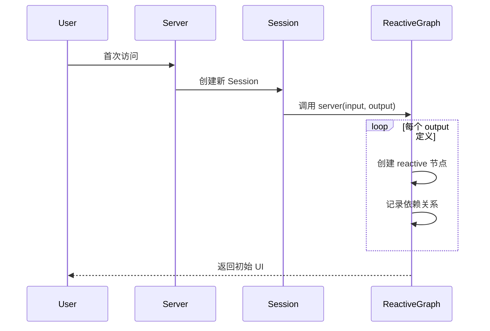

# Shiny 响应式引擎核心架构文档

## 一、架构总览

### 1.1 核心设计哲学

```
Shiny 响应式引擎 = 惰性求值 + 自动依赖追踪 + 级联失效传播
```

**一句话本质**：一个基于**全局上下文栈**的**声明式 DAG 执行引擎**，让普通 R 代码自动获得响应式能力。

### 1.2 架构分层

```
┌─────────────────────────────────────────────────────────┐
│                    应用层 (Application)                 │
│  ┌─────────┐  ┌─────────┐  ┌─────────┐  ┌─────────┐     │
│  │ UI 组件 │  │业务逻辑 │  │数据转换 │  │可视化   │     │
│  └─────────┘  └─────────┘  └─────────┘  └─────────┘     │
├─────────────────────────────────────────────────────────┤
│                  响应式层 (Reactive Layer)              │
│  ┌──────────────────────────────────────────────────┐   │
│  │  响应式节点：reactiveVal │ reactive │ observe    │   │
│  └──────────────────────────────────────────────────┘   │
│  ┌──────────────────────────────────────────────────┐   │
│  │  核心机制：依赖图 │ 失效传播 │ 惰性求值          │   │
│  └──────────────────────────────────────────────────┘   │
│  ┌──────────────────────────────────────────────────┐   │
│  │  基础设施：全局上下文栈 │ 闭包状态管理           │   │
│  └──────────────────────────────────────────────────┘   │
├─────────────────────────────────────────────────────────┤
│                   通信层 (Transport)                    │
│  ┌──────────────────────────────────────────────────┐   │
│  │  WebSocket │ HTTP │ Session 隔离 │ 状态同步      │   │
│  └──────────────────────────────────────────────────┘   │
├─────────────────────────────────────────────────────────┤
│                   运行时层 (Runtime)                    │
│  ┌──────────────────────────────────────────────────┐   │
│  │  R 进程池 │ 内存管理 │ 错误恢复 │ 调度器         │   │
│  └──────────────────────────────────────────────────┘   │
└─────────────────────────────────────────────────────────┘
```

---

## 二、核心数据结构

### 2.1 响应式节点基类

```
┌─────────────────────────────────────────┐
│          ReactiveNode (抽象)            │
├─────────────────────────────────────────┤
│ 状态:                                   │
│  - value: any           # 缓存值        │
│  - invalid: boolean     # 是否脏        │
│  - deps: List[Node]     # 上游依赖      │
│  - reverse_deps: List[Node] # 下游依赖  │
├─────────────────────────────────────────┤
│行为:                                    │
│  + invalidate(): void   # 标记失效      │
│  + get(): any           # 获取值        │
│  + addReverseDep(node)  # 添加反向依赖  │
└─────────────────────────────────────────┘
         △
         │
    ┌────┴───────────┬──────────┐
    │                │          │
┌───┴───────┐   ┌────┴───┐ ┌────┴────┐
│ReactiveVal│   │Reactive│ │ Observe │
│           │   │ Output │ │         │     
└───────────┘   └────────┘ └─────────┘
```

### 2.2 节点类型详解

#### ReactiveVal（源头节点）
```r
reactiveVal <- function(init = NULL) {
  env <- new.env()
  env$v <- init
  env$reverse_deps <- list()  # 谁依赖我
  
  fn <- function(value) {
    if (missing(value)) {
      # Getter: 注册当前上下文
      if (!is.null(.ctx)) {
        env$reverse_deps <- c(env$reverse_deps, .ctx)
        .ctx$deps <- c(.ctx$reverse_deps, env)。
      }
      env$v
    } else {
      # Setter: 触发失效传播
      env$v <- value
      for (dep in env$reverse_deps) {
        dep$invalidate()
      }
    }
  }
  fn
}
```

**特性**：
- 存储**原始状态**
- **无上游依赖**（deps 为空）
- Setter 触发**广播失效**

#### Reactive（计算节点）
```r
reactive <- function(expr) {
  env <- new.env()
  env$invalid <- TRUE
  env$value <- NULL
  env$deps <- list()        # 我依赖谁
  env$reverse_deps <- list() # 谁依赖我
  env$expr <- expr
  
  fn <- function() {
    # 注册：当前上下文依赖我
    if (!is.null(.ctx)) {
      .ctx$deps <- c(.ctx$deps, env)
      env$reverse_deps <- c(env$reverse_deps, .ctx)
    }
    
    # 惰性求值
    if (env$invalid) {
      old <- .ctx
      .ctx <<- env
      
      # 清理旧依赖
      for (dep in env$deps) {
        dep$reverse_deps <- remove(env, dep$reverse_deps)
      }
      env$deps <- list()
      
      # 执行表达式（自动收集新依赖）
      env$value <- eval(env$expr)
      env$invalid <- FALSE
      
      .ctx <<- old
    }
    env$value
  }
  fn
}
```

**特性**：
- **惰性计算**：只在被读取时求值
- **自动依赖追踪**：执行时收集
- **结果缓存**：clean 时直接返回

#### Observe（终点节点）
```r
observe <- function(expr) {
  env <- new.env()
  env$invalid <- TRUE
  env$deps <- list()
  
  # 与 reactive 类似，但：
  # 1. 自动执行（不需要被读取）
  # 2. 执行副作用
  # 3. 不返回值
  
  execute <- function() {
    if (env$invalid) {
      # 类似 reactive 的依赖收集
      # 但执行 expr 不返回值
      env$invalid <- FALSE
    }
  }
  
  # 注册到调度器，失效时自动执行
  return(invisible())
}
```

**特性**：
- **主动执行**：失效后立即重算
- **副作用操作**：打印、绘图、写文件
- **无返回值**

---

## 三、核心机制

### 3.1 全局上下文栈（灵魂机制）

```
┌─────────────────────────────────────────┐
│          Global Context Stack           │
├─────────────────────────────────────────┤
│  ┌─────────────────────────────────┐    │
│  │   .ctx = Reactive Node C        │ ← 当前执行节点
│  └─────────────────────────────────┘    │
│  ┌─────────────────────────────────┐    │
│  │   .ctx = Reactive Node B        │    │
│  └─────────────────────────────────┘    │
│  ┌─────────────────────────────────┐    │
│  │   .ctx = Reactive Node A        │    │
│  └─────────────────────────────────┘    │
└─────────────────────────────────────────┘

工作流程：
1. 进入 reactive A：push .ctx = A
2. A 读取 reactiveVal X：X 注册 A 为依赖
3. A 调用 reactive B：push .ctx = B
4. B 读取 reactiveVal Y：Y 注册 B 为依赖
5. B 返回：pop .ctx = A
6. A 返回：pop .ctx = NULL
```

**核心价值**：
- **对普通函数透明**：任意嵌套都能自动追踪
- **无需修改 R 语法**：不依赖 AST 解析
- **零侵入设计**：只在 getter/setter 处检查

### 3.2 依赖图构建与维护

```
构建时机（依赖收集）：
┌──────────┐
│ Reactive │ 执行时
│    A     │──────┐
└──────────┘      │
                  ▼
         读取 ReactiveVal X
                  │
                  ▼
         X 注册 A 到 reverse_deps
                  │
                  ▼
         A 注册 X 到 deps

维护策略（失效传播）：
     ReactiveVal X 更新
            │
            ▼
    遍历 X$reverse_deps
            │
            ├─→ Reactive A: invalid = TRUE
            │         │
            │         ▼
            │    遍历 A$reverse_deps
            │         │
            │         └─→ Reactive C: invalid = TRUE
            │
            └─→ Reactive B: invalid = TRUE
```

### 3.3 依赖图可视化

```
输入层                  计算层                  输出层
┌─────────┐
│input$x  │ (reactiveVal)
└────┬────┘
     │ reverse_deps: [y]
     │
     ▼
┌─────────┐      ┌─────────┐
│   y     │ ───→ │  _3y    │
│reactive │      │reactive │
└────┬────┘      └────┬────┘
     │                │
     │ deps: [input$x]│ deps: [y]
     │                │
     └────────┬───────┘
              │
              ▼
        ┌──────────┐
        │ output$y │ (observe)
        └──────────┘

传播路径：
input$x 更新 → y 失效 → _3y 失效 → output$y 自动重算
```

---

## 四、完整数据流

### 4.1 初始化阶段



### 4.2 交互更新阶段

```
用户点击按钮
    │
    ▼
WebSocket: /session/input/xxx/set
    │
    ▼
后端: input$xxx(new_value)
    │
    ▼
reactiveVal setter:
    - 更新内部值
    - 遍历 reverse_deps
    - 标记所有下游为 invalid
    │
    ▼
级联失效传播:
    reactive A (invalid)
    reactive B (invalid)
    observe C (invalid)
    │
    ▼
调度器:
    - 收集所有失效的 observe/output
    - 按优先级排序
    - 异步执行
    │
    ▼
observe/output 执行:
    - 读取依赖（触发惰性求值）
    - reactive 链式重算
    - 生成新结果
    │
    ▼
WebSocket: 推送更新到前端
    │
    ▼
前端 DOM 自动更新
```

### 4.3 惰性求值细节

```
第一次读取 reactive R：
┌─────────────────────────────────────┐
│ R$invalid = TRUE                    │
├─────────────────────────────────────┤
│ 1. push .ctx = R                    │
│ 2. 清理旧的 deps 关系               │
│ 3. 执行表达式 expr                  │
│    ├─ 读取 A() → 注册依赖           │
│    ├─ 读取 B() → 注册依赖           │
│    └─ 计算 C = A + B                │
│ 4. 缓存结果到 R$value               │
│ 5. R$invalid = FALSE                │
│ 6. pop .ctx                         │
└─────────────────────────────────────┘
返回缓存值

第二次读取（未失效）：
┌─────────────────────────────────────┐
│ R$invalid = FALSE                   │
├─────────────────────────────────────┤
│ 直接返回 R$value（无计算）          │
└─────────────────────────────────────┘

上游更新后读取：
┌─────────────────────────────────────┐
│ R$invalid = TRUE (被上游标记)       │
├─────────────────────────────────────┤
│ 重新执行完整计算流程                │
└─────────────────────────────────────┘
```

---

## 五、Session 隔离机制

### 5.1 架构图

```
┌─────────────────────────────────────────────────────────┐
│                    Server Process                       │
├─────────────────────────────────────────────────────────┤
│                                                         │
│  ┌──────────────┐  ┌──────────────┐  ┌──────────────┐   │
│  │  Session 1   │  │  Session 2   │  │  Session N   │   │
│  │              │  │              │  │              │   │
│  │ ┌──────────┐ │  │ ┌──────────┐ │  │ ┌──────────┐ │   │
│  │ │ input$x  │ │  │ │ input$x  │ │  │ │ input$x  │ │   │
│  │ │   = 10   │ │  │ │   = 20   │ │  │ │   = 15   │ │   │
│  │ └──────────┘ │  │ └──────────┘ │  │ └──────────┘ │   │
│  │ ┌──────────┐ │  │ ┌──────────┐ │  │ ┌──────────┐ │   │
│  │ │   y =    │ │  │ │   y =    │ │  │ │   y =    │ │   │
│  │ │  x+1=11  │ │  │ │  x+1=21  │ │  │ │  x+1=16  │ │   │
│  │ └──────────┘ │  │ └──────────┘ │  │ └──────────┘ │   │
│  │              │  │              │  │              │   │
│  │ 独立依赖图   │  │ 独立依赖图   │  │ 独立依赖图   │   │
│  └──────────────┘  └──────────────┘  └──────────────┘   │
│                                                         │
│  共享资源：静态文件、全局函数、包                       │
└─────────────────────────────────────────────────────────┘
```

### 5.2 Server 函数即工厂

```r
server <- function(input, output, session) {
  # 每次新用户访问，这个函数执行一次
  # 创建全新的闭包环境
  
  # 每个用户独立的 reactiveVal
  user_data <- reactiveVal()
  
  # 每个用户独立的依赖图
  output$plot <- renderPlot({
    input$x  # 这个 input 属于当前 session
  })
  
  # 函数结束时，所有 reactive 节点被垃圾回收
}
```

**关键特性**：
- **状态隔离**：每个用户的 reactiveVal 互不干扰
- **计算隔离**：一个用户的密集计算不影响其他用户
- **自动清理**：session 结束，整个依赖图被回收

---

## 六、与传统架构对比

### 6.1 传统 MVC（如 Spring/Flask）

```
┌─────────────────────────────────────────────┐
│                 MVC 架构                    │
├─────────────────────────────────────────────┤
│                                             │
│  用户请求 → Controller → Model → View       │
│      ↑                         ↓            │
│      └─────────────────────────┘            │
│                                             │
│  特点：                                     │
│  • 请求-响应模式                            │
│  • 手动连接 Model 和 View                   │
│  • 状态需显式管理（Session/DB）             │
│  • 更新需手动触发                           │
└─────────────────────────────────────────────┘

代码示例（伪代码）：
controller.get("/user/:id", (req, res) => {
  const user = User.find(req.params.id)  // Model
  res.render("user.html", { user })       // View
  // 需要手动连接 Model → View
})
```

### 6.2 Shiny 响应式架构

```
┌─────────────────────────────────────────────┐
│            Shiny 响应式架构                 │
├─────────────────────────────────────────────┤
│                                             │
│  input$x (reactiveVal)                      │
│      ↓ 自动                                 │
│  reactive(y = x + 1)                        │
│      ↓ 自动                                 │
│  output$text (observe)                      │
│      ↓ 自动                                 │
│  前端更新                                   │
│                                             │
│  特点：                                     │
│  • 长连接（WebSocket）                      │
│  • 自动连接（符号即连接）                   │
│  • 状态内建（reactiveVal）                  │
│  • 自动更新（响应式传播）                   │
└─────────────────────────────────────────────┘

代码示例（R Shiny）：
server <- function(input, output) {
  # output$text 自动依赖 input$slider
  output$text <- renderText({
    paste("Value:", input$slider)
  })
  # 无需手动连接，自动响应
}
```

### 6.3 核心差异总结

| 维度 | 传统 MVC | Shiny 响应式 |
|------|----------|--------------|
| **连接方式** | 手动接线（Controller） | 自动装配（符号即连接） |
| **更新机制** | 请求-响应 | 推送-响应式传播 |
| **状态管理** | 显式（DB/Session） | 隐式（reactiveVal） |
| **依赖追踪** | 无 | 自动（上下文栈） |
| **并发模型** | 每请求新建 | 每会话隔离图 |
| **学习曲线** | 需理解 MVC 模式 | 需理解响应式思维 |

---

## 七、设计模式与最佳实践

### 7.1 核心设计模式

#### 1. **观察者模式（增强版）**
```r
# Subject: reactiveVal
# Observer: reactive/observe
# 增强：自动依赖收集 + 级联传播
```

#### 2. **惰性求值模式**
```r
# 只在需要时计算，缓存结果
# 适合计算密集型操作
heavy_calculation <- reactive({
  Sys.sleep(10)  # 只在上游变化时执行
  input$x * 1000
})
```

#### 3. **闭包隔离模式**
```r
# 每个 reactive 节点是闭包
# 状态封装在环境中
counter <- reactiveVal(0)
# 外部无法直接修改内部值，只能通过 setter
```

### 7.2 反模式与陷阱

#### ❌ 在 reactive 中产生副作用
```r
bad <- reactive({
  print("计算中")  # 副作用
  input$x * 2
})
# 问题：何时打印不可预测
```

#### ✅ 使用 observe 处理副作用
```r
good <- observe({
  print(paste("x 变为:", input$x))
})
```

#### ❌ 循环依赖
```r
a <- reactive({ b() + 1 })
b <- reactive({ a() + 1 })
# 死循环！
```

### 7.3 性能优化建议

1. **使用 bindEvent 减少重算**
```r
expensive <- reactive({
  Sys.sleep(10)
  input$x
}) |> bindEvent(input$button)  # 只在按钮点击时重算
```

2. **隔离不必要的依赖**
```r
output$text <- renderText({
  isolate(input$temp)  # 不追踪 temp 变化
  paste("Value:", input$x)
})
```

3. **使用 reactiveValues 管理多个状态**
```r
values <- reactiveValues(a=1, b=2, c=3)
# 比多个 reactiveVal 更高效
```

---

## 八、总结

### 8.1 架构精髓

```
Shiny 响应式引擎 = 
    全局上下文栈（依赖追踪）
    + 双向依赖图（失效传播）
    + 惰性求值（性能优化）
    + Session 隔离（多用户）
```

### 8.2 核心洞察

1. **魔法背后的真相**：不是 AST 解析，不是运算符重载，而是**巧妙的闭包 + 全局变量**

2. **透明性的来源**：普通函数完全不知道响应式的存在，却自动获得响应式能力

3. **自装配的本质**：代码即管线，符号自带连接，无需外部配置

4. **隔离的关键**：server 函数每次执行创建新闭包，天然隔离

### 8.3 一句话总结

> **Shiny 是一个基于全局上下文栈实现自动依赖追踪的声明式 DAG 执行引擎，通过惰性求值和级联失效传播，让普通 R 代码自动获得响应式能力。**

---

## 附录：完整示例代码

```r
# 最小完整实现
library(shiny)

ui <- fluidPage(
  sliderInput("x", "X", 1, 100, 50),
  textOutput("y"),
  textOutput("z")
)

server <- function(input, output, session) {
  # 响应式图自动构建
  output$y <- renderText({
    paste("Y =", input$x + 1)  # 自动依赖 input$x
  })
  
  output$z <- renderText({
    paste("Z =", input$x * 2)  # 自动依赖 input$x
  })
  # 修改 input$x，y 和 z 自动更新
}

shinyApp(ui, server)
```

这个文档完整揭示了 Shiny 从底层机制到上层架构的全貌，可作为深入理解 Shiny 的路线图。
