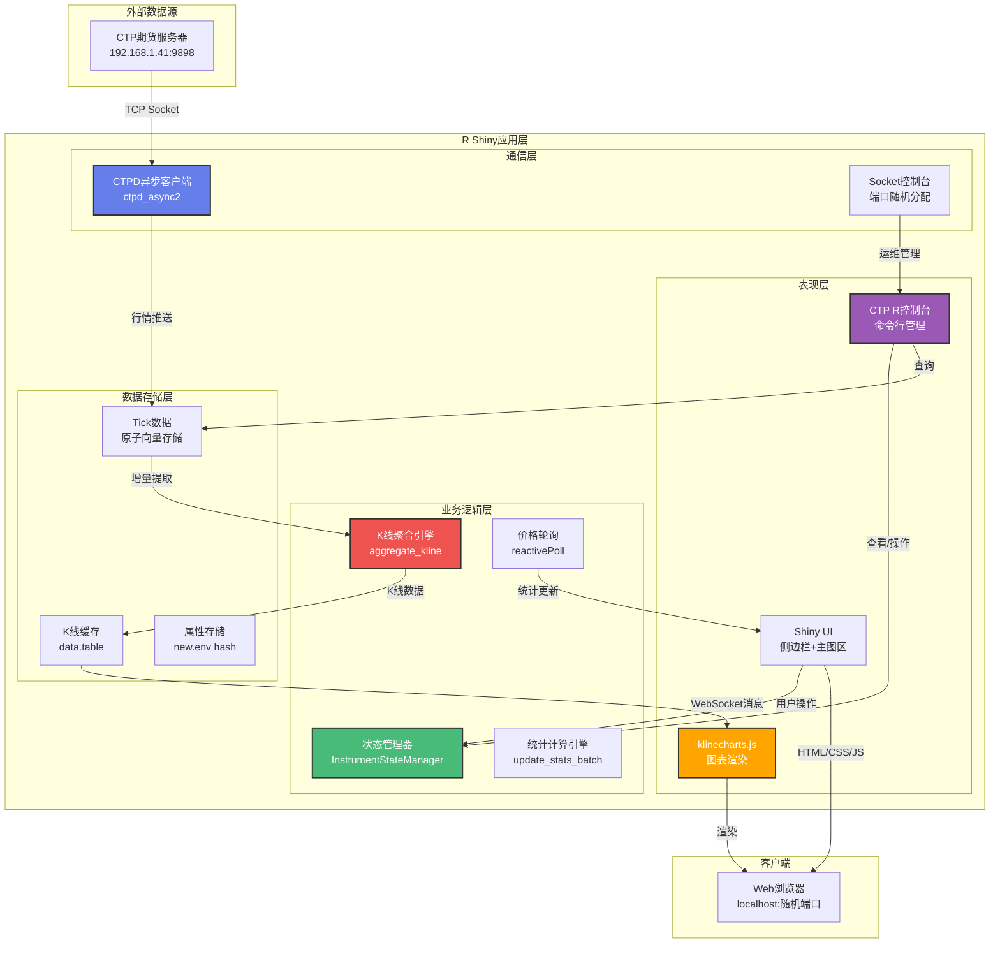
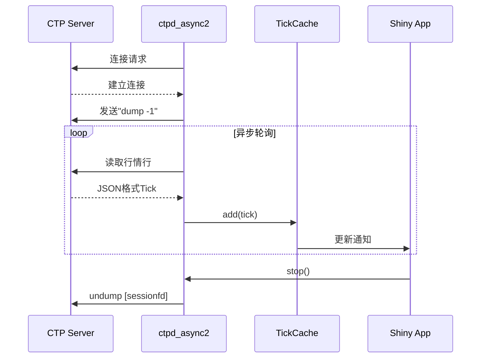
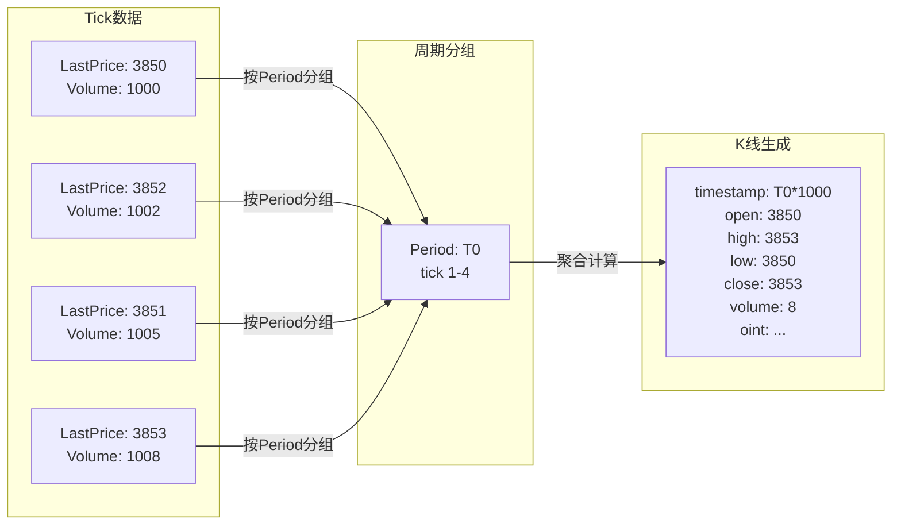
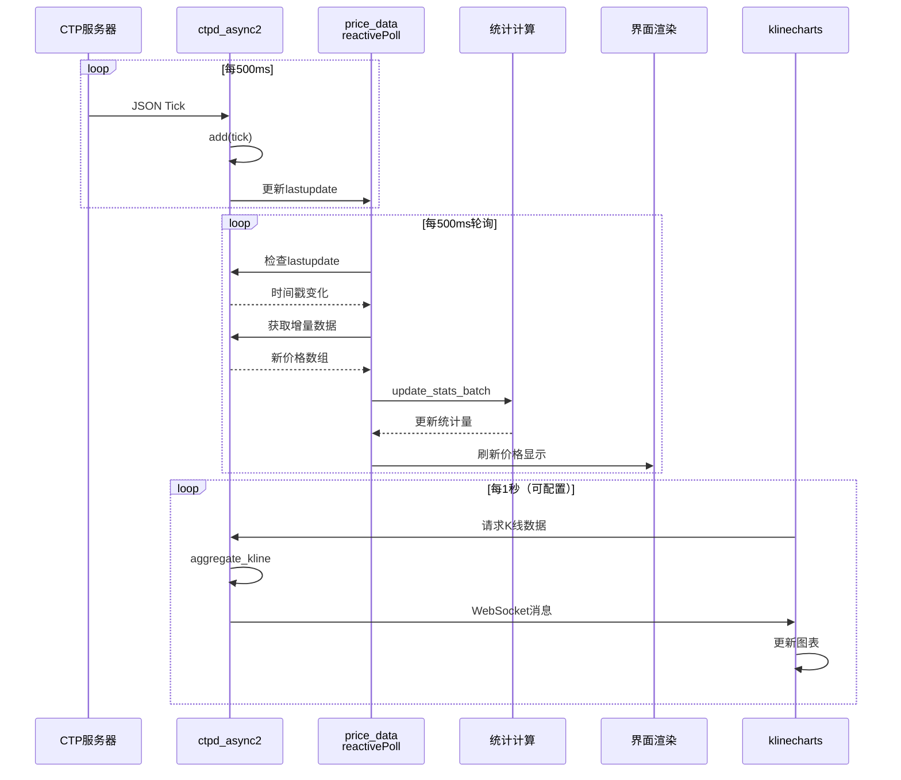
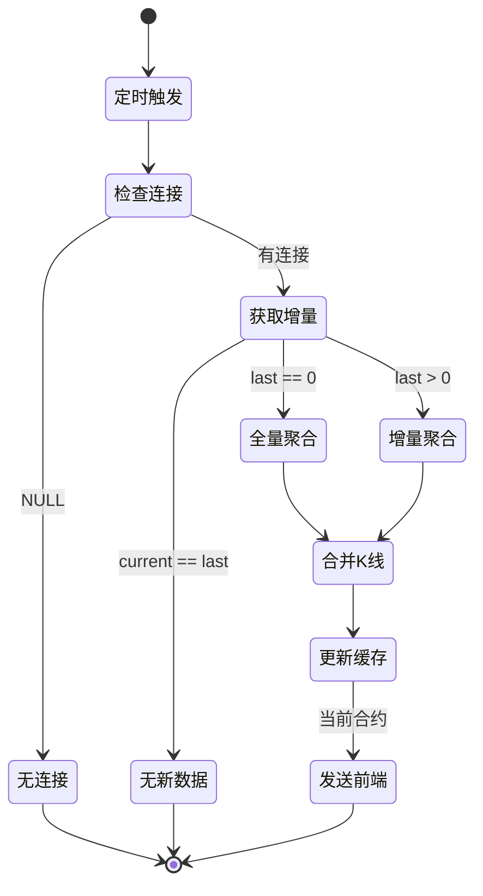
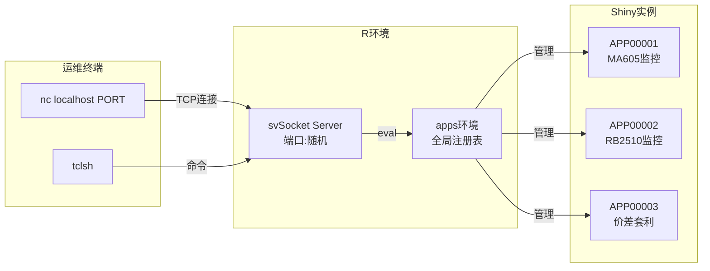
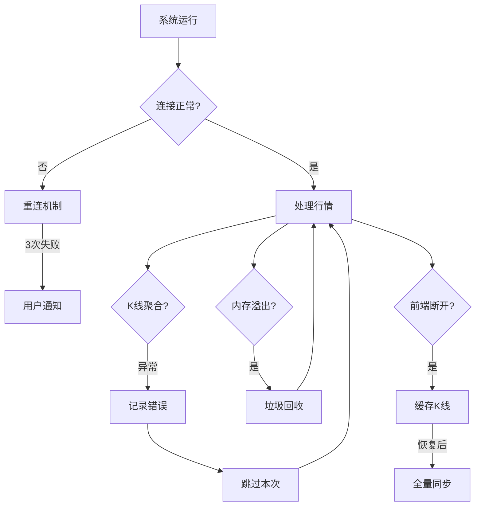

# CTP实时K线图系统架构设计文档

## 1. 系统概述

本系统是一个基于R Shiny的实时期货行情监控平台，通过异步TCP连接接收CTP（中国期货市场监控中心）行情数据，实时聚合K线并提供可视化图表展示。

### 1.1 核心功能
- 实时行情数据接收与存储
- 多周期K线聚合（1-1440分钟）
- 实时价格统计（均值、极值、标准差）
- 盘口行情展示（五档买卖盘）
- 多合约切换管理
- 技术指标展示（MA、VOL、KDJ、MACD、OINT）

---

## 2. 系统架构图



---

## 3. 核心模块设计

### 3.1 CTPD异步客户端 (`ctpd_async2`)

**职责**：管理与CTP服务器的TCP连接，异步接收行情数据

**数据结构**：
```r
# 合约存储结构（每个合约独立环境）
instruments[[instrument_id]] = {
    # 原子向量（预分配容量20000）
    LastPrice: numeric[capacity]
    Volume: integer[capacity]
    OpenInterest: integer[capacity]
    DateTime: numeric[capacity]
    
    # 五档盘口
    AskPrice1-5: numeric[capacity]
    AskVolume1-5: integer[capacity]
    BidPrice1-5: numeric[capacity]
    BidVolume1-5: integer[capacity]
    
    # 方法
    add(tick)        # 追加新tick
    size()           # 当前数据量
    last_tick()      # 获取最新tick
    ticks_dt(idx)    # 转换为data.table
}
```

**工作流程**：


### 3.2 状态管理器 (`InstrumentStateManager`)

**职责**：管理多合约的K线缓存、tick计数、统计属性

```r
class InstrumentStateManager {
    # 核心存储
    kline_cache: list[instrument_id] = data.table  # K线数据
    tick_counts: list[instrument_id] = integer      # 已处理tick数
    attrs: environment[hash]                        # 统计属性
    current_instrument_id: string                   # 当前合约
    current_period: integer                         # 当前周期（分钟）
    
    # 方法
    get_kline_dt(instrument_id)
    set_kline_dt(instrument_id, dt)
    clear_instrument(instrument_id)
    clear_all()
    set_current(instrument_id, period)
}
```

### 3.3 K线聚合引擎

**核心算法**：



**增量合并策略**：
```r
merge_kline_dt = function(base_dt, new_dt) {
    # 1. 更新连接：合并已存在的K线
    base_dt[new_dt, on = "timestamp", `:=`(
        high = pmax(high, i.high),
        low = pmin(low, i.low),
        close = i.close,
        volume = volume + i.volume,
        oint = i.oint
    )]
    
    # 2. 追加新K线
    new_rows = new_dt[!base_dt, on = "timestamp"]
    base_dt = rbind(base_dt, new_rows)
    
    return(base_dt)
}
```

### 3.4 统计计算引擎

**递推更新算法**（Welford在线算法）：

```r
update_stats_batch = function(prev_stats, new_prices) {
    # 输入：历史统计 + 新价格数组
    # 输出：更新后的统计量
    
    new_n = prev_n + k
    new_mean = (prev_n * prev_mean + sum(new_prices)) / new_n
    
    # M2更新（离差平方和）
    sum_sq_new = sum((new_prices - new_mean)^2)
    new_M2 = prev_M2 + sum_sq_new + prev_n * (prev_mean - new_mean)^2
    
    # 极值更新
    new_min = min(prev_min, min(new_prices))
    new_max = max(prev_max, max(new_prices))
    
    return(list(
        n = new_n,
        mean = new_mean,
        sd = sqrt(new_M2 / (new_n - 1)),
        min = new_min,
        max = new_max,
        last = new_prices[k]
    ))
}
```

**优势**：
- O(1)时间复杂度
- 无需存储历史价格
- 数值稳定性高

---

## 4. 数据流设计

### 4.1 实时数据流



### 4.2 K线更新策略



---

## 5. 前端架构

### 5.1 图表库集成

```javascript
// klinecharts.js 集成架构
{
    // 1. 指标注册
    indicators: [
        "MA", "VOL", "MACD", "KDJ", "OINT"
    ],
    
    // 2. 消息处理器
    handlers: {
        updateKline: (data) => {
            if (data.type === "full") {
                chart.applyNewData(data.ds);
            } else {
                data.ds.forEach(k => chart.updateData(k));
            }
        },
        switchInstrument: (msg) => {
            clearChart();
            currentInstrument = msg.instrument;
        }
    },
    
    // 3. 样式配置
    styles: {
        candle: { upColor: "#ef5350", downColor: "#26a69a" },
        grid: { color: "#2d2d3f" }
    }
}
```

### 5.2 实时行情面板

```
┌─────────────────────────────────┐
│ 状态栏 ●已连接 | MA605          │
├─────────────────────────────────┤
│ 实时行情                        │
│ MA605                           │
│ 最新: 3852.00  均: 3848.50     │
│ 最高: 3855.00  低: 3840.00     │
│ Ticks: 12450  时间: 14:35:22   │
├─────────────────────────────────┤
│ 卖盘 Ask        买盘 Bid        │
│ 3853.00  100    3852.00  50    │
│ 3854.00  200    3851.00  80    │
│ 3855.00  150    3850.00 120    │
└─────────────────────────────────┘
```

---

## 6. 运维管理控制台

### 6.1 Socket控制台架构



### 6.2 常用运维命令

```r
# 查看所有应用实例
apps |> ls()

# 查看特定合约统计
apps$APP00001$state$attrs$MA605 |> unlist()

# 导出Tick数据
insts <- ctpclient$instruments
insts$MA605$aslist() |> 
    data.table::rbindlist() |> 
    write.csv("ma605.csv")

# 实时价格分布
insts$MA605$aslist() |> 
    data.table::rbindlist() |> 
    with(hist(LastPrice, main="MA605价格分布"))
```

---

## 7. 性能优化设计

### 7.1 内存优化

| 优化策略 | 实现方式 | 效果 |
|---------|---------|------|
| 预分配向量 | `numeric(capacity)` | 减少动态扩容 |
| 线性扩容 | 容量不足时翻倍 | 平衡内存与性能 |
| 原子向量存储 | 基础R类型 | 降低开销 |
| data.table存储 | 列式存储K线 | 高效聚合 |

### 7.2 计算优化

```r
# 1. 批量处理
update_stats_batch(prev, new_prices)  # O(1) vs O(n)

# 2. 增量聚合
idx <- (last_count + 1):current_count  # 仅处理新增tick

# 3. data.table原地更新
base_dt[new_dt, on = "timestamp", `:=`(high = pmax(high, i.high))]
```

### 7.3 网络优化

- 异步非阻塞I/O（`later`包）
- 可配置推送间隔（0.1-5秒）
- 增量K线传输（减少带宽）

---

## 8. 容错设计



---

## 9. 部署架构

### 9.1 单机部署

```bash
# 启动应用
Rscript klc2.R

# 访问地址
http://localhost:随机端口

# 运维控制台
nc localhost 随机端口
```

### 9.2 端口分配策略

```r
rand_port(min_port=1024, max_port=65535) {
    1. 随机生成端口
    2. 尝试socketConnection
    3. 连接失败=端口可用
    4. 重试最多100次
}
```

---

## 10. 技术栈总结

| 层次 | 技术选型 | 用途 |
|-----|---------|------|
| 后端框架 | Shiny | Web应用框架 |
| 数据存储 | data.table | K线数据存储与聚合 |
| 异步通信 | later + svSocket | 定时任务与Socket服务 |
| 对象编程 | R6 | 状态管理类 |
| 前端图表 | klinecharts.js | K线图渲染 |
| 网络协议 | TCP Socket + JSON | 行情数据传输 |
| 并发模型 | 事件驱动 + 轮询 | 非阻塞数据处理 |

---

## 11. 系统亮点

1. **增量聚合算法**：避免全量重算，降低CPU消耗
2. **递推统计**：在线计算均值/方差，内存占用恒定
3. **原子向量存储**：Tick数据紧凑存储，支持线性扩容
4. **运维控制台**：Socket接口支持动态管理
5. **多实例隔离**：每个浏览器会话独立状态
6. **可视化丰富**：集成5种技术指标
7. **容错机制**：断线重连、异常捕获、日志记录

---

## 12. 扩展建议

### 12.1 功能扩展
- 策略回测引擎集成
- 多周期联动显示
- 价差套利监控
- 自动交易接口

### 12.2 性能扩展
- 使用Rcpp重写核心聚合算法
- Redis缓存历史K线
- WebSocket替代轮询

### 12.3 部署扩展
- Docker容器化
- 多进程负载均衡
- 数据库持久化
